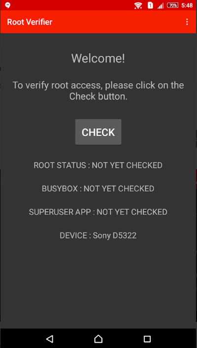

<<<<<<< HEAD
# Check if the Phone is Rooted

## What is "root"?

"root" is a system superuser account on all Android systems (actually all UNIX-like operating systems, including Linux, macOS and iOS). The root user is allowed to do anything on the system. Usually, only a few (but not all) system processes run as root. User applications never run as root, but in less privileged (normal) accounts.

Sometimes, users want to customize the system in a way not allowed for normal accounts, such as to remove the built-in apps installed by the vendor ("bloatware") to release storage space. In this case, users need to "root" their system, which means to obtain direct control of the "root" account on the system.

Rooting generally involves:

1. Unlock the device bootloader.
2. Flash a custom "recovery operating system" (often just called "recovery"), which is a minimal operating system living on a separate storage partition. The original purpose of recovery is to install system updates.
3. Using the custom recovery, flash (install) the root bundle.

In the rooting process, important system security features are disabled (such as bootloader unlock). A rooted system also adds more attack vector to the system.

## Look for Root-Related Applications

When a phone is rooted, the process often involves installing an application to manage root access, most of the time [Magisk](https://github.com/topjohnwu/Magisk) (or [SuperSU](http://www.supersu.com/) on old versions of Android). One first step is to check if the Magisk application is installed. You can check directly for the icon in your main menu, or go to **Settings > Applications** and search the application.

## Check with Root Verifier

Root Verifier is an [open source](https://github.com/abcdjdj/RootVerifier-APP) application that check if an Android Phone is rooted through different techniques. You can install it from the [Google Play Store](https://play.google.com/store/apps/details?id=com.abcdjdj.rootverifier) or from the [F-Droid repository](https://f-droid.org/packages/com.abcdjdj.rootverifier/).

Once installed, you can launch the application. The interface is really simple, you just need to click on "CHECK" and wait for the result.

 
=======
# Verificar se foi feito root no telefone

## O que é _root_?

_Root_ (raíz, em tradução literal) é uma conta de superusuário do sistema em todos os sistemas Android (na verdade, todos os sistemas operacionais do tipo UNIX, incluindo Linux, macOS e iOS). O usuário _root_ tem permissão para realizar qualquer ação no sistema. Normalmente, apenas alguns processos do sistema são executados como _root_ (mas isso não se aplica a todos). Os aplicativos de usuário nunca são executados como _root_, mas sim em contas com menos privilégios (contas normais).

Às vezes, os usuários querem personalizar o sistema de uma forma não permitida para contas normais, como remover os aplicativos integrados instalados pelo fornecedor (_bloatware_) para liberar espaço de armazenamento. Nesse caso, os usuários precisam fazer o _root_ do sistema, o que significa obter o controle direto da conta _root_ no sistema.

O _rooting_ (literalmente enraizamento, mas aqui com o sentido de ganhar acesso e privilégios de usuários root) geralmente envolve:

1. Desbloquear o carregador de inicialização do dispositivo.
2. "Fazer _flash_ " um “sistema operacional de recuperação” personalizado (geralmente chamado apenas de “recuperação”), que é um sistema operacional mínimo que fica em uma partição de armazenamento separada. O objetivo original da recuperação é instalar atualizações do sistema.
3. Usando a recuperação personalizada, fazer o _flash_ (instalação) do pacote de root.

No processo de root, importantes recursos de segurança do sistema são desativados (como o desbloqueio do carregador de inicialização). Um sistema com root também adiciona mais vetores de ataque ao sistema.

## Procure aplicativos relacionados ao root

Quando um telefone tem acesso ao root (à raiz), o processo geralmente envolve a instalação de um aplicativo para gerenciar o acesso à raiz, na maioria das vezes o [Magisk](https://github.com/topjohnwu/Magisk) (ou [SuperSU](http://www.supersu.com/) em versões antigas do Android). Uma primeira etapa é verificar se o aplicativo Magisk está instalado. Você pode verificar diretamente o ícone no menu principal ou ir para **Configurações > Aplicativos** e procurar o aplicativo.

## Verificar com o Root Verifier

O Root Verifier é um aplicativo [open source](https://github.com/abcdjdj/RootVerifier-APP) que verifica se um telefone Android está enraizado (rooted) por meio de diferentes técnicas. Você pode instalá-lo na [Google Play Store ](https://play.google.com/store/apps/details?id=com.abcdjdj.rootverifier) ou no [repositório F-Droid](https://f-droid.org/packages/com.abcdjdj.rootverifier/) .&#x20;

NB: Para instalar via F-Droid, será necessário ativar a carga lateral, ou _sideloading_. O que recomendamos fazer pontualmente e com muito cuidado. Veja a sessão Aplicativos com carregamento lateral (sideload) no capítulo [Revisar Aplicativo Instalados](applications.md).

Depois de instalado, você pode iniciar o aplicativo. A interface é muito simples, você só precisa clicar em “CHECK” e aguardar o resultado.

 
>>>>>>> 08764f159532245dbd422df65bec951b7323b37b
