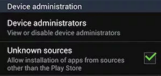
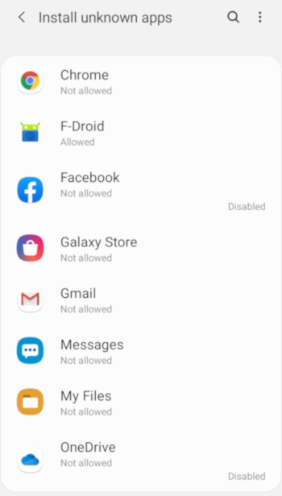
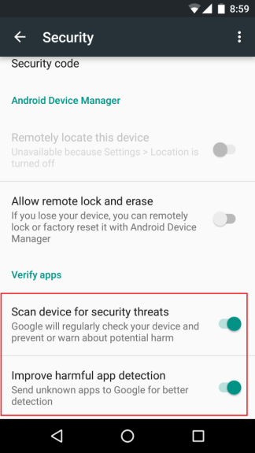

<<<<<<< HEAD
# Optional : Check for Indicators of Stalkerware Installation

Stalkerwares are malicious applications used in the context of Intimate Partner Violence. One of the difference with classic android malware is that they are installed through a physical access to the smartphone. Because of this, the installation requires some changes on the Android system that can often be identified later on.

## Check if Installation from Unknown Sources is Authorized

Stalkerware applications are installed directly from the application file (APK), which is by default forbidden by Android. To install the application, the person needs to allow the installation from Unknown Sources.

Before Android 8 "Oreo", this feature was enabled for the entire phone. If you have a phone before Android 8, go to **Settings > Security** and check if **Unknown Sources** is enabled.

After Android 8, this feature is enabled per application. Go to **Settings > Security > Install unknown apps** to see the list of applications allowed to install untrusted applications.

Any application in this list is suspicious, especially browsers and file managers.

## Check if Google Play Protect is Disabled

Google Play Protect is an automated detection of malicious applications developed and maintained by Google as part of their Google Play Services. This feature often needs to be disabled during the installation of a stalkerware application because it can detect the malicious app.

To check this setting, you should have to go to **Settings > Security > Scan Devices for Security Threats** or **Settings > Security > Google Play Protect** depending on your version of Android.

## Check if the Phone is Rooted

A stalkerware application often requires a rooted phone to have access to more data. Follow the recommendations of [this other part of this guide](root.md) to check if the phone is rooted.
=======
# Opcional: verificar se há indicadores de instalação de stalkerware

_Stalkerwares_ são aplicativos maliciosos usados ​​no contexto de violência de parceiros íntimos. Uma das diferenças com o malware Android clássico é que eles são instalados por meio de um acesso físico ao smartphone. Por isso, a instalação requer algumas alterações no sistema Android, que geralmente podem ser identificadas posteriormente.

## Verifique se a instalação de fontes desconhecidas está autorizada

Os aplicativos _stalkerware_ são instalados diretamente do arquivo do aplicativo (APK), que é proibido por padrão pelo Android. Para instalar o aplicativo, a pessoa precisa permitir a instalação de fontes desconhecidas.

Antes do Android 8 "Oreo", esse recurso era habilitado para todo o telefone. Se você tem um telefone anterior ao Android 8, vá para **Configurações > Segurança** e verifique se **Fontes desconhecidas** está habilitado.

Após o Android 8, esse recurso é habilitado por aplicativo. Vá para **Configurações > Segurança > Instalar aplicativos desconhecidos** ou , a depender da versao do Android, em **Configurações > Segurança e Privacidade > Mais Segurança e Privacidade > Fontes de Instalação** para ver a lista de aplicativos com permissão para instalar aplicativos não confiáveis.

<figure><figcaption></figcaption></figure>

Qualquer aplicativo com autorização de instalação de aplicações é suspeito, especialmente navegadores e gerenciadores de arquivos.

## Verifique se o Google Play Protect está desabilitado

O Google Play Protect é uma detecção automatizada de aplicativos maliciosos desenvolvida e mantida pelo Google como parte do Google Play Services. Esse recurso geralmente precisa ser desabilitado durante a instalação de um aplicativo _stalkerware_ porque ele pode detectar o aplicativo malicioso.

Para verificar essa configuração, você deve ir para **Configurações > Segurança > Verificar dispositivos em busca de ameaças à segurança** ou **Configurações > Segurança > Google Play Protect** ou **Configurações > Segurança e Privacidade > Google Play Protect** dependendo da sua versão do Android.

Em versões mais recentes, as telas para verificar o Play Protect pode se parecer com as seguintes:

<figure><figcaption></figcaption></figure>

<figure><figcaption></figcaption></figure>

## Verifique se o telefone foi "rooteado"

Um aplicativo _stalkerware_ geralmente requer um telefone rooteado para ter acesso a mais dados. Siga as recomendações [desta outra parte do guia](root.md) para verificar se o telefone está com root.
>>>>>>> 08764f159532245dbd422df65bec951b7323b37b
