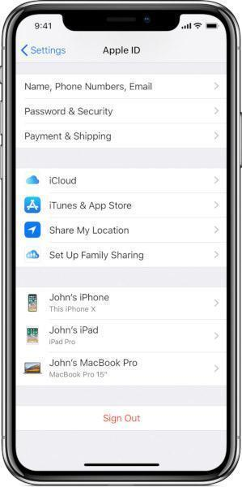

<<<<<<< HEAD
# Review iCloud Accounts

Low-sophistication attackers might be able to monitor the activity of an iOS device by adding an additional iCloud account. The account would then normally be configured to automatically backup to iCloud all the data available on the phone (such as pictures, messages, contacts, etc.). The addition of an iCloud account normally requires physical access to the device. Once the iCloud account is enabled on the device, attackers are then simply able to inspect the data directly from iCloud or using an external service that synchronizes with iCloud. For example, most stalkerware and "parental control" services are increasingly adopting this technique, and advertising it as a "No-Jailbreak" service.

Checking if an iOS device has unwanted iCloud accounts can be trivially done by opening the *Settings* and looking at the very top of the menu.

## Attackers Using Stolen Credentials

Obviously, if attackers have managed to steal the credentials to the legitimate iCloud account of the device owner, it is not necessary for them to add an additional account to the phone, leaving no visible trace. This is also [a common tactic](https://www.vice.com/en_us/article/4xpgnj/paranoid-spouses-can-spy-on-partners-ios-10-devices-with-icloud-backups). In this case, a potential check to perform is to look for any unrecognized device that appear to be enabled on the existing account. [Here are instructions on how to review connected devices](https://support.apple.com/en-us/HT205064).

*Image from Apple*
=======
# Revisar contas do iCloud

Invasores pouco sofisticados podem monitorar a atividade de um dispositivo iOS adicionando uma conta adicional do iCloud. Normalmente, essa conta é configurada para fazer backup automático, no iCloud, de todos os dados disponíveis no telefone (como fotos, mensagens, contatos etc.). A adição de uma conta do iCloud normalmente requer acesso físico ao dispositivo. Depois que a conta do iCloud é ativada no dispositivo, os invasores podem simplesmente inspecionar os dados diretamente no iCloud ou usando um serviço externo que sincroniza com o iCloud. Por exemplo, a maioria dos serviços de stalkerware e de “controle dos pais” está adotando cada vez mais essa técnica e anunciando-a como um serviço “_No-Jailbreak_”.

Para verificar se um dispositivo iOS tem contas indesejadas no iCloud, basta abrir as _Configurações_ e procurar na parte superior do menu.

## Invasores que usam credenciais roubadas

Obviamente, se os invasores conseguiram roubar as credenciais da conta legítima do iCloud do proprietário do dispositivo, não é necessário que eles acrescentem uma conta adicional ao telefone, sem deixar rastro visível. Essa também é [uma tática comum](https://www.vice.com/en_us/article/4xpgnj/paranoid-spouses-can-spy-on-partners-ios-10-devices-with-icloud-backups). Nesse caso, uma possível verificação a ser realizada é procurar por qualquer dispositivo não reconhecido que pareça estar ativado na conta existente. [Aqui estão as instruções sobre como revisar os dispositivos conectados](https://support.apple.com/pt-br/102649)

A seguir, uma imagem da tela de configuração de um iPhone, no site da Apple.

<figure><figcaption></figcaption></figure>
>>>>>>> 08764f159532245dbd422df65bec951b7323b37b
