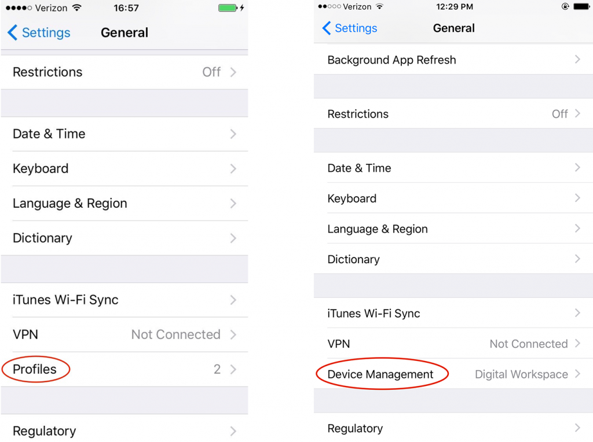

<<<<<<< HEAD
# Check for Mobile Device Management Profiles

Mobile Device Management (MDM) is a system commonly used by enterprises to control a fleet of mobile devices, and be able to, for example, issue configuration updates, install applications, or remotely wipe the data in case the device is lost. [Attackers have sometimes been seen abuse MDM](https://blog.talosintelligence.com/2018/07/Mobile-Malware-Campaign-uses-Malicious-MDM.html) in order to maintain control over their victims' phones, and install malicious applications.

The enrollment normally requires some manual interaction. An infection could happen, for example, if the attackers manage to obtain physical access to device (even for a short time), or by somehow social engineering the victims into enrolling themselves.

Similarly to malicious [iCloud accounts](icloud.md), MDM profiles should be visible in the settings of the device. If an MDM profile is installed on the device, opening "*Settings*", then "*General*", should reveal a "*Profile*" or "*Device Management*" menu option, typically below the "*iTunes Wi-Fi Sync*" and "*VPN*" menu options.

*Image from BlackBag Technologies*

If the device owner does not recognize the MDM profile, and if the MDM profile does not appear to belong to an organization or company the device owner works with, it is possible that the device has been compromised.
=======
# Verificar perfis de gerenciamento de dispositivos móveis

O Mobile Device Management (MDM) é um sistema comumente usado pelas empresas para controlar uma frota de dispositivos móveis e poder, por exemplo, emitir atualizações de configuração, instalar aplicativos ou limpar remotamente os dados em caso de perda do dispositivo. [Os atacantes às vezes são vistos abusando do MDM](https://blog.talosintelligence.com/2018/07/Mobile-Malware-Campaign-uses-Malicious-MDM.html) para manter o controle sobre os telefones de suas vítimas e instalar aplicativos mal-intencionados.

O processo de registro, normalmente, requer alguma interação manual. Uma infecção pode ocorrer, por exemplo, se os invasores conseguirem obter acesso físico ao dispositivo (mesmo que por um curto período) ou por meio de engenharia social das vítimas para que elas se registrem.

Da mesma forma que as [contas do iCloud mal-intencionadas](icloud.md) os perfis MDM devem estar visíveis nas configurações do dispositivo. Se um perfil MDM estiver instalado no dispositivo, a abertura de “_Configurações_” e, em seguida, “_Geral_”, deverá revelar uma opção de menu Perfil ou Gerenciamento de VPN e Dispositivo, ou Gerenciamento de Dispositivo.

<figure><figcaption></figcaption></figure>

<figure><figcaption></figcaption></figure>

Se o proprietário do dispositivo não reconhecer o perfil MDM e se o perfil MDM não parecer pertencer a uma organização ou empresa com a qual o proprietário do dispositivo trabalha, é possível que o dispositivo tenha sido comprometido.
>>>>>>> 08764f159532245dbd422df65bec951b7323b37b
