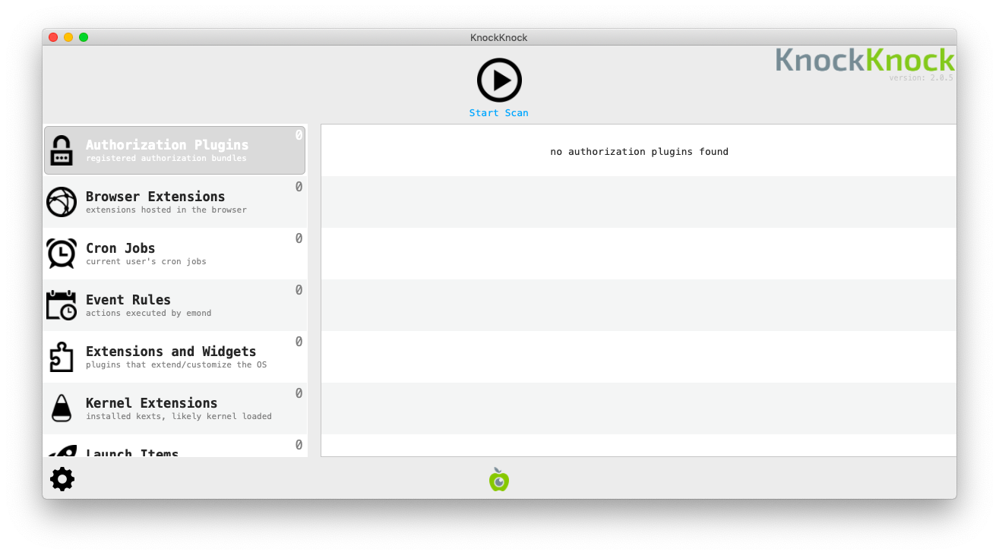
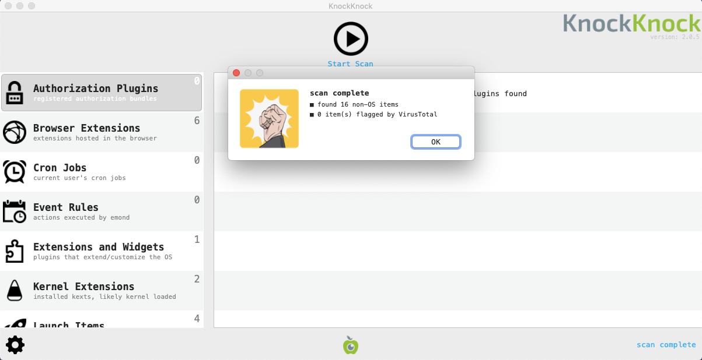
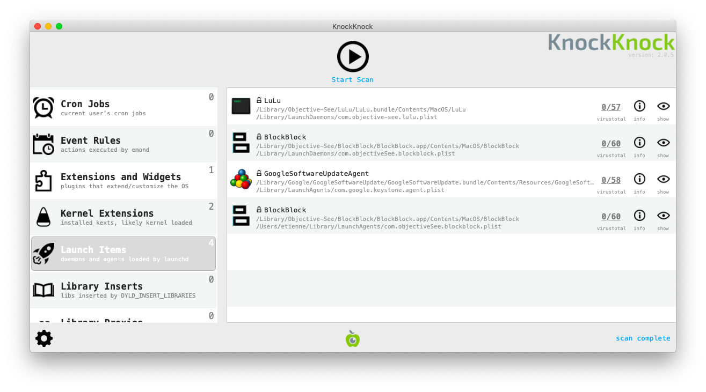
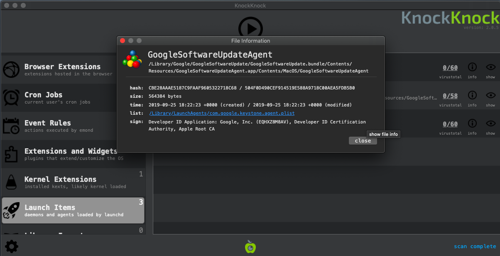

<<<<<<< HEAD
# Review Programs Launching at Startup

Most spyware need to find a way to run on start-up when a computer is restarted. It is thus interesting to review the list of program running on startup to identify potential malware. The program [KnockKnock](https://objective-see.com/products/knockknock.html) developed by Objective-See allows to list these programs.

## Launching KnockKnock

You first need to download the program from [its official page](https://objective-see.com/products/knockknock.html), then unzip the archive containing the program (double-clicking on it should work in most cases) and double-click on the KnockKnock program to launch it.

Once launched, you need to press the `Start Scan` button. KnockKnock will then scan known locations where persistent software or malware may be installed and check if they are known by [VirusTotal](https://www.virustotal.com/).

## Analyzing Results

KnockKnock does not automatically determine which programs are malicious or not. As with the rest of this [methodology](../methodology.md), it is necessary for you to eventually become familiar enough with its results to quickly spot any anomalies or entries that you do not recognize. It is also important that you talk with the system owner to identify which programs are unknown to them.

Following are some suggestions of patterns to look out for.

### 1. Verify Image Signatures

In modern versions of Mac OS, legitimate applications are generally required to be "signed" with a developer certificate. Such certificates allow to verify the producer of a particular program (such as Google, Adobe, or else). Applications that are not signed normally are more controlled and scrutinized by Mac OS security mechanisms. A useful first check is to verify whether an application is signed or not. To view the application signature, you have to click on the `(!) Info` icon on the right of the Application name. Please note that by default, Apple-signed programs are filtered out.

### 2. Check Program Names and Paths

KnockKnock shows the name that was given to the application by its developers. This information can be faked, but sometimes attackers are lazy enough to either mispell spoofed legitimate names (e.g. "Micorsoft Ofice" or "Crhome") or to just leave random characters and numbers.

MacOS applications are typically installed in a few folders depending on the type of application. Seeing an application running on startup from a non-standard folder does not mean it is malicious but is definitely suspicious and should be checked more in depth.

Here are the standard folders :

* Browser extensions are typically running from `/Users/<username>/Library/Application Support`
* Kernel Extensions : `/Library/Extensions` or `/System/Library/Extensions/`
* Other applications : `/Library` and `/Applications`

### 3. Check VirusTotal Scan Results

During the scan, KnockKnock is checking the fingerprint of applications running on startup over the [VirusTotal](https://virustotal.com/) database and showing the result in the menu.

Any file identified as malicious y at least one antivirus in VirusTotal should be checked (although there are some false positive, keep that in mind if a very small number of antiviruses only are detecting it as malicious). A file not known by VirusTotal is also suspicious as their database contains most common legitimate applications.

**Please note:** [As discussed](safety.md), under normal circumstances you would prefer to not connect the tested computer to the Internet. Without an Internet connection, you are not able to immediately check with VirusTotal. However, it is possible to save KnockKnock results clicking _Settings_ > _save scan results_ and later open the results from a separate computer with Internet connection.
=======
# Revisar programas abertos na inicialização

A maioria dos _spywares_ precisa encontrar uma maneira de ser executada na inicialização quando o computador é reiniciado. Portanto, é interessante revisar a lista de programas executados na inicialização para identificar possíveis malwares. O programa [KnockKnock](https://objective-see.com/products/knockknock.html) desenvolvido pela Objective-See permite listar esses programas.

## Como iniciar o KnockKnock

Primeiro, é necessário fazer o download do programa em [sua página oficial](https://objective-see.com/products/knockknock.html) depois descompactar o arquivo que contém o programa (clicar duas vezes nele deve funcionar na maioria dos casos) e clicar duas vezes no programa KnockKnock para iniciá-lo.

_NB: a interface do KnockKnock não está disponível em português._

Uma vez iniciado, você precisa pressionar o botão `Start Scan`. O KnockKnock fará a varredura dos locais conhecidos onde um software persistente ou malware possa estar instalado e verificará se eles são conhecidos pelo [VirusTotal](https://www.virustotal.com/).

## Análise de resultados

O KnockKnock não determina automaticamente quais programas são mal-intencionados ou não. Assim como no restante desta [metodologia](../methodology.md), é necessário que você se familiarize o suficiente com seus resultados para identificar rapidamente quaisquer anomalias ou entradas que não reconheça. Também é importante que você converse com o proprietário do sistema para identificar quais programas são desconhecidos para ele.

Veja a seguir algumas sugestões de padrões a serem observados.

### 1. Verifique as assinaturas dos aplicativos (_image signature_)

**Nota:** no contexto de detecção e análise de malware. Image pode significar imagem de disco de instalação de um aplicativo (_disk image_), ou a representação binária do executável do aplicativo já instalado. &#x20;

Nas versões modernas do macOS, os aplicativos legítimos geralmente precisam ser “assinados” com um certificado de desenvolvedor. Esses certificados permitem verificar quem é o produtor de um determinado programa (como Google, Adobe ou outro). Os aplicativos que não são assinados normalmente são mais controlados e examinados pelos mecanismos de segurança do macOS. Uma primeira verificação útil é checar se um aplicativo está assinado ou não. Para visualizar a assinatura do aplicativo, clique no ícone `(!) Info` à direita do nome do aplicativo. Observe que, por padrão, os programas assinados pela Apple são filtrados.

### 2. Verifique os nomes e os caminhos dos programas

O KnockKnock mostra o nome que foi dado ao aplicativo por seus desenvolvedores. Essas informações podem ser falsificadas, mas, às vezes, os invasores são preguiçosos o suficiente para escrever incorretamente nomes legítimos falsificados (por exemplo, “Micorsoft Ofice” ou “Crhome”) ou simplesmente deixar caracteres e números aleatórios.

Os aplicativos do macOS geralmente são instalados em algumas pastas, dependendo do tipo de aplicativo. O fato de um aplicativo ser executado na inicialização a partir de uma pasta não padrão não significa que ele seja mal-intencionado, mas é definitivamente suspeito e deve ser verificado mais detalhadamente.

Aqui estão as pastas padrão:

* Extensões de navegador normalmente são executadas em `/Usuários/<nome de usuário>/Biblioteca/Application Support.`Na versão em inglês: `/Users/<username>/Library/Application Support`
* Extensões do kernel: `/Biblioteca/Extensions` ou `/Sistema/Biblioteca/Extensions/`. Na versão em inglês: `/Library/Extensions` ou `/System/Library/Extensions/`
* Outros aplicativos: `Biblioteca` e `Aplicativos`. Na versão em inglês: `Library` e `Applications`&#x20;

### 3. Checar os resultados da verificação do VirusTotal

Durante a verificação, o KnockKnock checa a impressão digital dos aplicativos executados na inicialização no banco de dados do [VirusTotal](https://virustotal.com/) e mostra o resultado no menu.

Qualquer arquivo identificado como mal-intencionado por pelo menos um antivírus, no VirusTotal, deve ser verificado (embora haja alguns falsos positivos, tenha isso em mente se apenas um número muito pequeno de antivírus estiver detectando-o como mal-intencionado). Um arquivo não conhecido pelo VirusTotal também é suspeito, pois seu banco de dados contém os aplicativos legítimos mais comuns.

**Observação:** conforme [discutido em Segurança](../safety.md), em circunstâncias normais, você deve desconectar da Internet o computador que está sendo testado. Sem uma conexão com a Internet, não é possível fazer uma verificação imediata com o VirusTotal. No entanto, é possível salvar os resultados do KnockKnock clicando em _Configurações_ > _Salvar resultados da verificação_ e, posteriormente, abrir os resultados em um computador separado com conexão à Internet.
>>>>>>> 08764f159532245dbd422df65bec951b7323b37b
