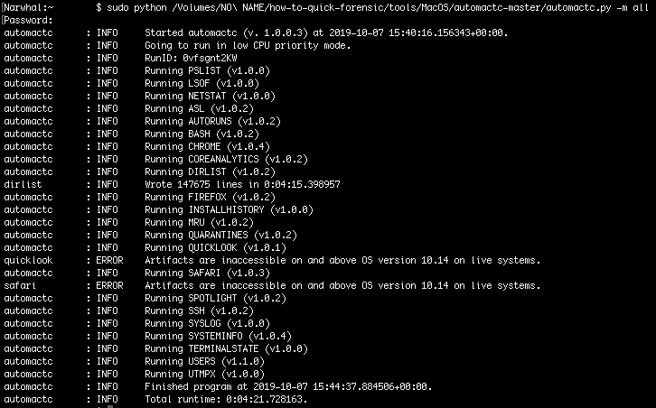

<<<<<<< HEAD
# Extract Data for Further Analysis

If you have not found anything suspicious on the system but want to investigate further without the system, it is possible to collect interesting forensic data in order to analyze them later using [AutoMacTC](https://www.crowdstrike.com/blog/automating-mac-forensic-triage/).

Important note:

* This program can extract some private information (such as browser history), keep that in mind while using it.
* This program has not been updated since 2021, only supports up to macOS 11.

## Launching AutoMacTC

You first need to download AutoMacTC from [the Github repository](https://github.com/CrowdStrike/automactc/archive/master.zip) and extract it.

Then you have to launch a terminal, from the menu > `Other` > `Terminal`. To run the program you need to know the path of the extracted AutoMacTC code and run `sudo python <PATH>/automactc-master/automactc.py -m all`.

Running this command with the argument `-m all` will extract all the data available. It is also possible to extract more specific data by passing the name of a specific module. Here is the list of modules from [AutoMacTC documentation](https://www.crowdstrike.com/blog/automating-mac-forensic-triage/) :

* pslist : current process list at time of AutoMacTC run
* lsof : current file handles open at time of AutoMacTC run
* netstat : current network connections at time of AutoMacTC run
* asl : parsed Apple System Log (.asl) files
* autoruns : parsing of various persistence locations and plists
* bash : parsing `bash/.*_history` files for all users
* chrome : parsing chrome visit history and download history
* coreanalytics : parsing program execution evidence produced by Apple diagnostics
* dirlist : list of files and directories across the disk
* firefox : parsing firefox visit history and download history
* installhistory : parsing program installation history
* mru : parsing SFL and MRU plist files
* quarantines : parsing QuarantineEventsV2 database
* quicklook : parsing Quicklooks database
* safari : parsing safari visit history and download history
* spotlight : parsing user spotlight top searches
* ssh : parsing known\_hosts and authorized\_keys files for each user
* syslog : parsing system.log files
* systeminfo : basic system identification, such as current IP address, serial no, hostname
* users : listing present and deleted users on the system
* utmpx : listing user sessions on terminals

## Data Extracted

All the data extracted are saved in an archive name `automactc-output,<computername>,<ipaddress>,<date>.tar.gz`. It contains csv files with results for all modules executed.
=======
# Extrair dados para análise adicional

Se você não encontrou nada suspeito no sistema, mas deseja investigar mais a fundo quando estiver sem acesso ao sistema, é possível coletar dados forenses interessantes para analisá-los posteriormente usando o [AutoMacTC](https://www.crowdstrike.com/blog/automating-mac-forensic-triage/).

Observação importante:

* Esse programa pode extrair algumas informações privadas (como o histórico do navegador), portanto, tenha isso em mente ao usá-lo.
* Este programa não é atualizado desde 2021, sendo compatível apenas até o macOS 11.

## Como iniciar o AutoMacTC

Primeiro, você precisa baixar o AutoMacTC do [repositório do Github](https://github.com/CrowdStrike/automactc/archive/master.zip) e extraí-lo.

Em seguida, é necessário iniciar um terminal, no menu > `Other` > `Terminal`. Para executar o programa, você precisa saber o caminho do código AutoMacTC extraído e executar `sudo python <PATH>/automactc-master/automactc.py -m all`.

A execução desse comando com o argumento `-m all` extrairá todos os dados disponíveis. Também é possível extrair dados mais específicos passando o nome de um módulo específico. Aqui está a lista de módulos da [documentação do AutoMacTC](https://www.crowdstrike.com/blog/automating-mac-forensic-triage/) :

* pslist: lista de processos atuais no momento da execução do AutoMacTC
* lsof: identificadores de arquivos atuais abertos no momento da execução do AutoMacTC
* netstat: conexões de rede atuais no momento da execução do AutoMacTC
* asl: arquivos de registro do sistema Apple (.asl) analisados
* autoruns: análise de vários locais de persistência e listas
* bash: análise de arquivos `bash/.*_history` para todos os usuários
* chrome: análise do histórico de visitas e do histórico de downloads do Chrome
* coreanalytics: análise de evidências de execução de programas produzidas pelo diagnóstico da Apple
* dirlist: lista de arquivos e diretórios no disco
* firefox : análise do histórico de visitas e de downloads do Firefox
* installhistory: análise do histórico de instalação do programa
* mru : análise de arquivos plist SFL e MRU
* quarantines : análise do banco de dados QuarantineEventsV2
* quicklook : análise do banco de dados Quicklooks
* safari : análise do histórico de visitas e de downloads do Safari
* spotlight : análise das principais pesquisas do usuário no Spotlight
* ssh: análise dos arquivos known\_hosts e authorized\_keys de cada usuário
* syslog: análise de arquivos system.log
* systeminfo : identificação básica do sistema, como endereço IP atual, número de série, nome do host
* users : listagem de usuários presentes e excluídos no sistema
* utmpx: listagem de sessões de usuário em terminais

## Dados extraídos

Todos os dados extraídos são salvos em um arquivo chamado `automactc-output,<computername>,<ipaddress>,<date>.tar.gz`. Ele contém arquivos csv com resultados de todos os módulos executados.
>>>>>>> 08764f159532245dbd422df65bec951b7323b37b
