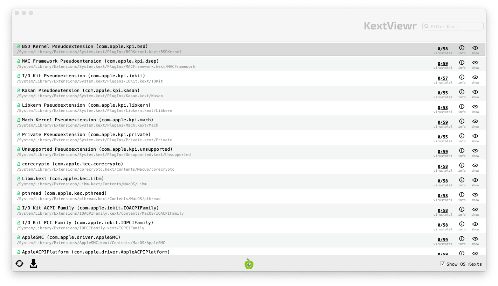
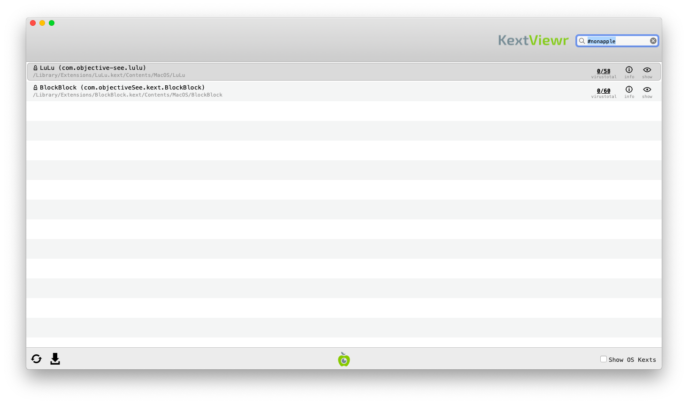

<<<<<<< HEAD
# Review Kernel Extensions

Kernel extensions (often called kexts) are programs extending the features of the MacOS kernel and as such they are running with the highest privilege, which make them interesting for malware. The tool [KextViewr](https://objective-see.com/products/kextviewr.html) developed by Objective-See allows to list all loaded kernel extensions.

## Launching Kext Viewer

To launch KextViewr, download it first from [its official page](https://objective-see.com/products/kextviewr.html). Then extract the program from the archive and double click on it :

## Analyzing Results

### 1. Verify Image Signatures

Similarly than with other tools, KextViewr displays the signature status with a icon near the name, a green locked icons  means that the extension is signed by Apple, a closed black lock  means that the extension is signed by another company while an open orange lock  means that the extension is not signed.

To view only 3rd party kernel extensions, you can uncheck the `Show OS Kexts` checkbox at the bottom of KextViewr window.

### 2. Check Program Names Paths

As with previous steps, you should check kexts name and paths. The name should give you an indication of the utility of the kext, any typo or random string here is suspicious.

For the extension paths, OS Kexts should run from `/System` while non-OS Kexts should run from `/Library`.

### 3. Check VirusTotal Scan Results

KextViewr also checks file fingerprint on VirusTotal. On the right of each task running, you will see two numbers representing first the number of antiviruses that identified this file as malicious and then the total number of antiviruses tested. An question mark will appear if this program is not known by VirusTotal.

You should investigate further any task identified by at least one antivirus as malicious or not known by VirusTotal.

**Please note:** the same considerations and warnings explained in the [previous section](autoruns.md) apply here too. Make sure to read them before proceeding.

=======
# Revisar extensões do kernel

As extensões do _kernel_ (geralmente chamadas de _kexts_) são programas que ampliam os recursos do _kernel_ do macOS e, como tal, são executados com o privilégio mais alto, o que os torna interessantes para malware. A ferramenta [KextViewr](https://objective-see.com/products/kextviewr.html) desenvolvida pela Objective-See permite listar todas as extensões do kernel carregadas.

_NB: a interface do Kext Viewer não está disponível em português._

## Como iniciar o Kext Viewer

Para iniciar o KextViewr, primeiro faça o download [em sua página oficial](https://objective-see.com/products/kextviewr.html). Em seguida, extraia o programa do arquivo e clique duas vezes nele:

## Análise dos resultados

### 1. Verificar assinaturas de imagem

Da mesma forma que em outras ferramentas, o KextViewr exibe o status da assinatura com um ícone próximo ao nome, um ícone verde bloqueado  significa que a extensão é assinada pela Apple, um cadeado preto fechado  significa que a extensão é assinada por outra empresa, enquanto um cadeado laranja aberto  significa que a extensão não é assinada.

Para visualizar apenas as extensões de kernel de terceiros, você pode desmarcar a caixa de seleção `Show OS Kexts` na parte superior da janela do KextViewr.

### 2. Verificar os nomes dos programas e os caminhos

Como nas etapas anteriores, você deve verificar o nome e os caminhos das kexts. O nome deve lhe dar uma indicação da utilidade da kext; qualquer erro de digitação ou cadeia aleatória aqui é suspeito.

Para os caminhos de extensão, os Kexts do sistema operacional devem ser executados a partir de `/Sistema` (/`System`, na versão em inglês), enquanto os Kexts que não são do sistema operacional devem ser executados a partir de `/Biblioteca` (/Library na versão em inglês).

### 3. Verificar os resultados da verificação do VirusTotal

O KextViewr também verifica a impressão digital do arquivo no VirusTotal. À direita de cada tarefa em execução, você verá dois números que representam primeiro o número de antivírus que identificaram esse arquivo como malicioso e, em seguida, o número total de antivírus testados. Um ponto de interrogação aparecerá se esse programa não for conhecido pelo VirusTotal.

Você deve investigar mais a fundo qualquer tarefa identificada por pelo menos um antivírus como maliciosa ou não conhecida pelo VirusTotal.

**Observe:** as mesmas considerações e avisos explicados na seção [Revisar programas abertos na inicialização](autoruns.md) também se aplicam aqui. Certifique-se de lê-los antes de prosseguir.
>>>>>>> 08764f159532245dbd422df65bec951b7323b37b
