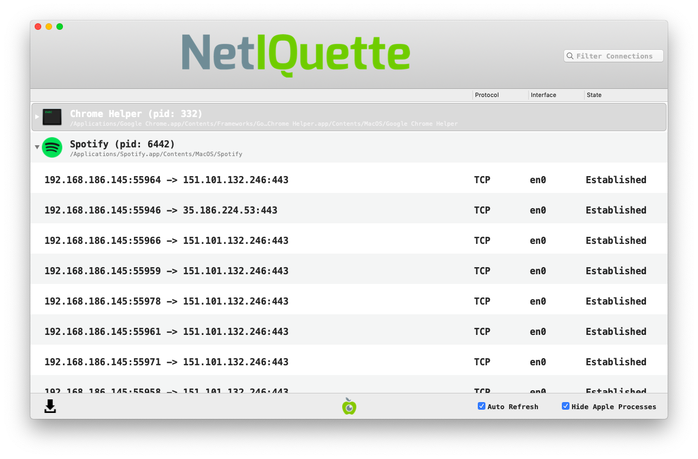

<<<<<<< HEAD
# Review Network Connections

Spyware will eventually need to transmit the collected data (such as screenshots, passwords, keystrokes, etc.) to a remote location, the [Command & Control server](https://securitywithoutborders.org/resources/digital-security-glossary.html#cnc). While it is not possible to be able to predict when such transmission will occur, it is possible that some spyware will establish a permanent connection with the server, or that it will connect frequently enough for you to catch it.

In order to do check for ongoing connections you can, for example, record the whole network traffic using [Wireshark](https://www.wireshark.org/) and later inspect the stored results. However, a more interesting approach is to use tools that not only monitor the network activity, but that can also tie them to running processes. Generally, you should look for unusual processes connecting to suspicious IP addresses.

One popular tool to do this is [Netiquette](https://objective-see.com/products/netiquette.html) developed by Objective-See.

The tool is pretty straightforward: it lists all established network connections and provide information on the originating process, and the destination. You will likely be surprised to observe the amount of network connections active even with seemingly idle systems. The first step to search for suspicious network connections is to close all the apps running on your system that you do not need right now, it will remove some noise during the analysis.

Then look at the applications one by one, and estimate if it is legitimate that they communicate with the network. If it is, look at the different connections from this process to see if they seem legitimate. You should keep in mind a few information about network addresses :
* `127.0.0.1` is the localhost address, any connection to it means that the program is talking to the computer itself, so it is legitimate
* IP addresses starting with `192.168.` or `10.` are private addresses, that either belong to your computer or to a computer on your own private network.

To have more information about an IP address, you can use the online tools [CentralOps](https://centralops.net/co/) or [IPinfo](https://ipinfo.io/), they will tell you to which network an IP belong to, but they may not give you the real user of an IP address, so you will have to develop a sense of what is normal on a network or not.

For instance on the screenshot above, we see a connection from the Spotify process to the IP address `151.101.132.246`, checking on CentralOps, we see that this IP address belongs to the organisation Fastly, an American cloud provider used by many companies like Spotify as [Content Delivery Network](https://en.wikipedia.org/wiki/Content_delivery_network), this is thus a legitimate connection.
=======
# Revisar conexões de rede

O spyware precisará eventualmente transmitir os dados coletados (como capturas de tela, senhas, pressionamentos de teclas etc.) para um local remoto, o [servidor Command & Control.](https://web.archive.org/web/20221208140438/https://securitywithoutborders.org/resources/digital-security-glossary.html#cnc/) Embora não seja possível prever quando essa transmissão ocorrerá, é possível que algum spyware estabeleça uma conexão permanente com o servidor ou que se conecte com frequência suficiente para que você o detecte.

Para verificar se há conexões em andamento, você pode, por exemplo, registrar todo o tráfego de rede usando o [Wireshark](https://www.wireshark.org/) e, posteriormente, inspecionar os resultados armazenados. Entretanto, uma abordagem mais interessante é usar ferramentas que não apenas monitorem a atividade da rede, mas que também possam vinculá-la aos processos em execução. Em geral, você deve procurar processos incomuns que se conectem a endereços IP suspeitos.

Uma ferramenta popular para fazer isso é o [Netiquette](https://objective-see.com/products/netiquette.html), desenvolvido pela Objective-See.

_NB: a interface do NetIQuete não está disponível em português._

A ferramenta é bastante simples: ela lista todas as conexões de rede estabelecidas e fornece informações sobre o processo de origem e o destino. Você provavelmente ficará surpreso ao observar a quantidade de conexões de rede ativas mesmo em sistemas aparentemente ociosos. A primeira etapa da pesquisa de conexões de rede suspeitas é fechar todos os aplicativos em execução no sistema que não sejam necessários no momento, pois isso removerá alguns ruídos durante a análise.

Em seguida, examine os aplicativos um a um e avalie se é legítimo que eles se comuniquem com a rede. Se for, observe as diferentes conexões desse processo para ver se parecem legítimas. Você deve ter em mente algumas informações sobre endereços de rede:

* `127.0.0.1` é o endereço do _localhost_ (servidor local); qualquer conexão com ele significa que o programa está falando com o próprio computador, portanto, é legítimo.
* Os endereços IP que começam com`192.168.` or `10.`são endereços privados, que pertencem ao seu computador ou a um computador em sua própria rede privada.

Para obter mais informações sobre um endereço IP, você pode usar as ferramentas online [CentralOps](https://centralops.net/co/) ou [IPinfo](https://ipinfo.io/). Elas informarão a qual rede um IP pertence, mas talvez não forneçam o usuário real de um endereço IP, portanto, você terá que desenvolver uma noção do que é normal em uma rede ou não.

Por exemplo, na captura de tela acima, vemos uma conexão do processo do Spotify com o endereço `151.101.132.246.`Verificando no CentralOps, vemos que esse endereço IP pertence à organização Fastly, um provedor de nuvem americano usado por muitas empresas, como o Spotify, na função de Rede de Fornecimento de Conteúdo ([Content Delivery Network](https://en.wikipedia.org/wiki/Content_delivery_network) ou CDN), portanto, trata-se de uma conexão legítima.

>>>>>>> 08764f159532245dbd422df65bec951b7323b37b
