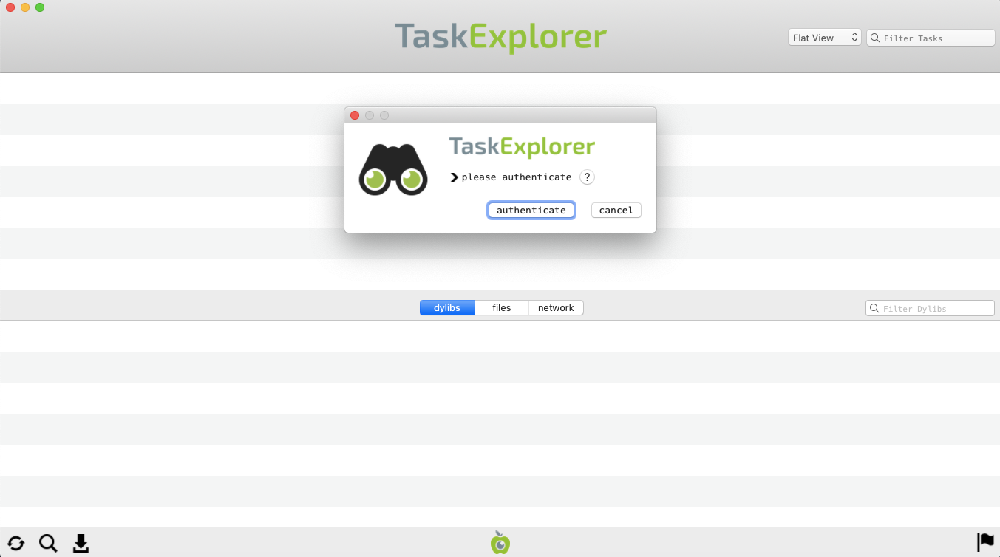
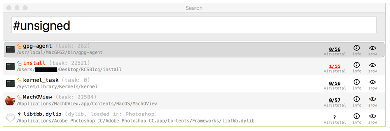
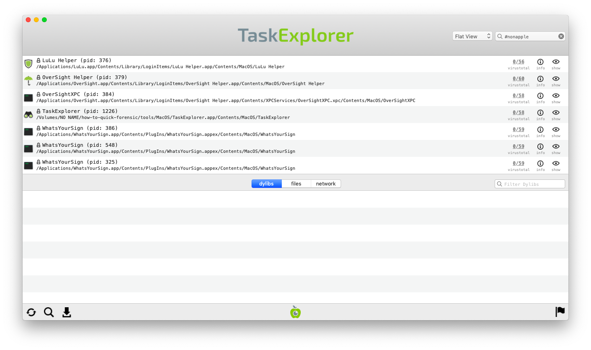
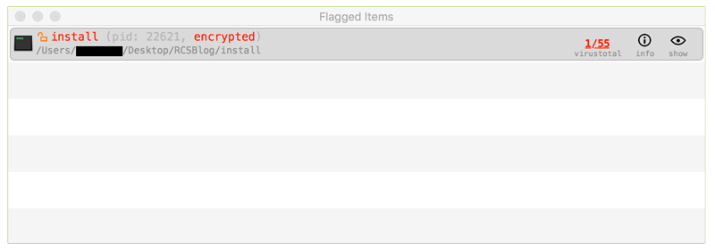

<<<<<<< HEAD
# Review Running Processes

A computer infected with spyware should have some malicious processes running at all times, monitoring the system and collecting data to be transmitted to the [Command & Control server](https://securitywithoutborders.org/resources/digital-security-glossary.html#cnc) of the attackers. Therefore, another required step in triaging a suspected MacOS computer is to extract the list of running processes and find if any of them display suspicious characteristics

The best tool to do so is [TaskExplorer](https://objective-see.com/products/taskexplorer.html) developed by Objective-See. You first need to download the program from [its official page](https://objective-see.com/products/taskexplorer.html), unzip the archive containing the program  (double-clicking on it should work in most cases) and double-click on the TaskExplorer program to launch it. On startup, it will ask for your password in order to get administrator privileges to list all the processes running.

Before proceeding with this check, it is advisable that you close all visible running applications, in order to reduce the outputs of the tools you will run to the bare minimum.

### 1. Verify Image Signature

Similarly to KnockKnock, TaskExplorer verifies the signature of applications running. This information is shown with a loc icon near the Application name, a green closed lock  means that an application belong to Apple, a black closed lock  means that it is a Non-Apple signed application and an open orange lock  means that the application is not signed.

You can filter tasks to see only non-signed applications by writing `#unsigned` in the filtering bar and hit enter :

### 2. Check for Suspicious Application Name and Path

As in the startup section, it is interesting to check for any application that has a suspicious name and path. The name of the application can be faked but in some cases, malware are using either spoofed name with typos (such as `Crhome`) or random strings.

The path of the application gives indication on where the application is running from. Any application running from a location other than `/Library` or `/Applications` should be investigated further.

To avoid checking legitimate applications signed by Apple, you can filter the tasks with the hashtag `#nonapple` in the fitering bar :

### 3. Looking up Programs on VirusTotal

Similarly to [Autoruns](autoruns.md) section, TaskExplorer also checks file fingerprint on VirusTotal. On the right of each task running, you will see two numbers representing first the number of antiviruses that identified this file as malicious and then the total number of antiviruses tested. An question mark will appear if this program is not known by VirusTotal.

You should investigate further any task identified by at least one antivirus as malicious or not known by VirusTotal.

**Please note:** the same considerations and warnings explained in the [previous section](autoruns.md) apply here too. Make sure to read them before proceeding.
=======
# Revisar processos em execução

Um computador infectado com spyware deve ter alguns processos mal-intencionados em execução o tempo todo, monitorando o sistema e coletando dados a serem transmitidos para o [servidor de Comando e Controle](https://securitywithoutborders.org/resources/digital-security-glossary.html#cnc) dos atacantes. Portanto, outra etapa necessária na triagem de um computador macOS suspeito é extrair a lista de processos em execução e verificar se algum deles apresenta características suspeitas

A melhor ferramenta para fazer isso é o [TaskExplorer](https://objective-see.com/products/taskexplorer.html) desenvolvido pela Objective-See. Primeiro, é necessário fazer o download do programa em [sua página oficial](https://objective-see.com/products/taskexplorer.html), descompactar o arquivo que contém o programa (clicar duas vezes nele deve funcionar, na maioria dos casos) e clicar duas vezes no programa TaskExplorer para iniciá-lo. Na inicialização, ele solicitará sua senha para obter privilégios de administrador e listar todos os processos em execução.

Antes de prosseguir com essa verificação, é recomendável que você feche todos os aplicativos visíveis em execução, a fim de reduzir ao mínimo as saídas das ferramentas que serão executadas.

_NB: a interface do TaskExplorer não está disponível em português._

### 1. Verificar a assinatura da imagem

Da mesma forma que o KnockKnock, o TaskExplorer verifica a assinatura dos aplicativos em execução. Essas informações são mostradas com um ícone de cadeado próximo ao nome do aplicativo: um cadeado verde fechado  significa que o aplicativo pertence à Apple, um cadeado preto fechado  significa que o aplicativo não é assinado pela Apple e um cadeado laranja aberto  significa que o aplicativo não é assinado.

Você pode filtrar as tarefas para ver apenas os aplicativos não assinados escrevendo `#unsigned` na barra de filtragem e pressionando Enter :

### 2. Verifique se há nome e caminho de aplicativo suspeito

Como na seção de inicialização, é interessante verificar se há algum aplicativo que tenha um nome e um caminho suspeitos. O nome do aplicativo pode ser falsificado, mas, em alguns casos, o malware está usando nomes falsos com erros de digitação (como `Crhome`) ou strings aleatórias.

O caminho do aplicativo fornece uma indicação de onde o aplicativo está sendo executado. Qualquer aplicativo executado em um local que não seja `Biblioteca` ou `Aplicativos` deve ser investigado mais a fundo.

Para evitar a verificação de aplicativos legítimos assinados pela Apple, você pode filtrar as tarefas com a hashtag `#nonapple` na barra de filtro:

### 3. Procurando programas no VirusTotal

Da mesma forma que o Autoruns visto na seção [Revisar programas abertos na inicialização](autoruns.md), o TaskExplorer também verifica a impressão digital do arquivo no VirusTotal. À direita de cada tarefa em execução, você verá dois números que representam primeiro o número de antivírus que identificaram esse arquivo como malicioso e, em seguida, o número total de antivírus testados. Um ponto de interrogação aparecerá se esse programa não for conhecido pelo VirusTotal.

Você deve investigar mais a fundo qualquer tarefa identificada por pelo menos um antivírus como maliciosa ou não conhecida pelo VirusTotal.

**Observação:** as mesmas considerações e avisos explicados na [seção anterior](autoruns.md) também se aplicam aqui. Certifique-se de lê-las antes de prosseguir.
>>>>>>> 08764f159532245dbd422df65bec951b7323b37b
