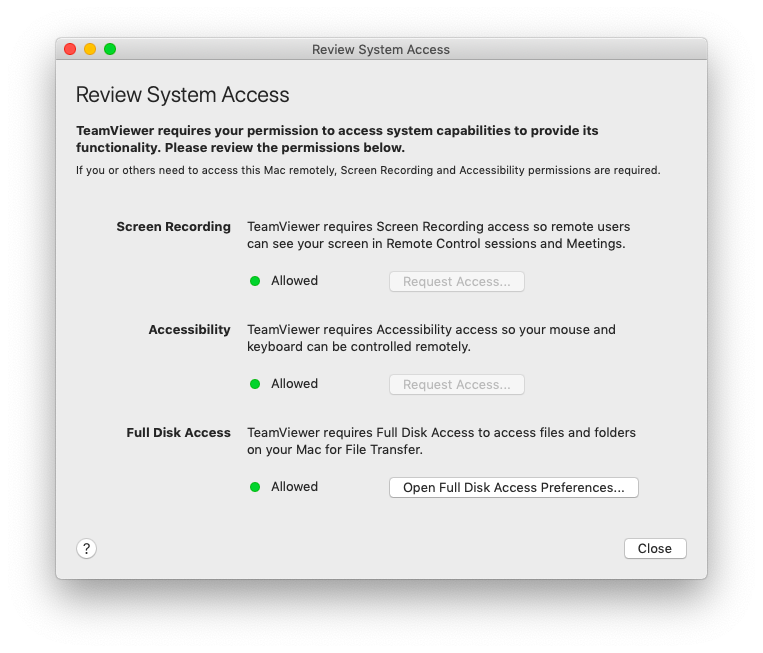

<<<<<<< HEAD
# Remote Checking a Mac Computer

## Asking the User to Install Teamviewer

### Installing Teamviewer

The user has to first download the [Mac OS Teamviewer client](https://www.teamviewer.com/en/download/mac-os/) from the website. When the `.dmg` file is downloaded, double click on it, then double click on the icon shown on the screen to start the Installation process.

The installation process is pretty straightforward, you need to accept the license and then install TeamViewer on the computer (it should requires less than 200MB of space).

At the end of the installation process, TeamViewer start the assistant to configure access rights on the system. You can skip this part.

### Giving Full Access to Teamviewer

Once it is installed, you should see the TeamViewer window. You now need to configure access rights, go to `Help > Check system access`.

For each of these steps, you need to click on "Request Access", which opens the relevant system configuration window and let you add TeamViewer in it. For each of them, you will have to first click on the lock icon on the bottom left of the window to get admin right, and then add TeamViewer to the list of applications authorized.

Once you have done all the steps, you should see all three system settings with a green dot written "Allowed". You should now quit TeamViewer and launch it when needed.

## Connecting to the User Computer

To connect to the user computer, you have to ask them to give you their id (a 10 digit number) and a password (a six character string including letters and numbers). Enter the user id in the `Control Remote Computer` part, and enter the password when asked for it.

### Transferring Files

You should now have Teamviewer connected. The first step is to copy all the programs you need for this check using the File Transfer tool. Go to the navigation bar at the top and click on `Open File Transfer` under `Files & Extras`. You should create a temporary folder, and then transfer all the needed programs from your computer, by selecting them and clicking on `Send`.

### Checking the computer

Once the programs are all transferred, you can proceed with the standard checks as described in the [Mac OS](mac.md) part of this guide. Please keep in mind that the connection may be slow and it can take more time than usual.

## Uninstalling Teamviewer

Once the check is done, the user should uninstall TeamViewer. To do that, they have to open the app, go to the page `TeamViewer > Preferences`, go the the `Advanced` tab and go to the bottom of the page in the `Uninstall section`. Click on `Also delete configuration files` and click on Uninstall.

=======
# Computadores Mac

## Pedindo ao usuário para instalar o Teamviewer

### Instalando o Teamviewer

O usuário deve primeiro fazer o download do cliente [Teamviewer para MacOs](https://www.teamviewer.com/pt/download/mac-os/). Quando o arquivo `.dmg` for baixado, deve clicar duas vezes nele e, em seguida, clicar duas vezes no ícone mostrado na tela para iniciar o processo de instalação.

<figure><figcaption></figcaption></figure>

O processo de instalação é bastante simples, é preciso aceitar a licença e, em seguida, instalar o TeamViewer no computador.

No final do processo de instalação, o TeamViewer inicia o assistente para configurar os direitos de acesso no sistema. Pode-se pular essa parte.

### Concedendo acesso total ao Teamviewer

Depois de instalado, o usuário deverá ver a janela do TeamViewer. Agora é preciso configurar os direitos de acesso. Quando este arquivo foi escrito, era necessário ir até `Help > Check system access`.

Para cada uma dessas etapas, o cliente precisa clicar em “Request Access” (Solicitar acesso), que abre a janela de configuração do sistema relevante e permite que você adicione o TeamViewer a ela. Para cada uma delas, será necessário primeiro clicar no ícone de cadeado na parte inferior esquerda da janela para obter o direito de administrador e, em seguida, adicionar o TeamViewer à lista de aplicativos autorizados.

Depois de executar todas as etapas, deverá ver as três configurações do sistema com um ponto verde escrito “Permitido”. Agora, poderá sair do TeamViewer e iniciá-lo quando necessário.

## Conexão com o computador do usuário

Para se conectar ao computador do usuário, é necessário pedir que ele forneça sua ID (um número de 10 dígitos) e uma senha (uma sequência de seis caracteres, incluindo letras e números). Digite o ID do usuário na parte `Control Remote Computer` e digite a senha quando solicitado.

### Transferindo arquivos

Agora você deve ter o Teamviewer conectado. A primeira etapa é copiar todos os programas necessários para esta verificação usando a ferramenta Transferência de arquivos. Vá até a barra de navegação na parte superior e clique em `Open File Transfer` em `Files & Extras`. Você deve criar uma pasta temporária e, em seguida, transferir todos os programas necessários de seu computador, selecionando-os e clicando em `Send`.

### Verificando o computador

Depois que todos os programas forem transferidos, prossiga com as verificações padrão, conforme descrito na parte MacOS deste guia. Lembre-se de que a conexão pode estar lenta e pode levar mais tempo do que o normal.

## Desinstalação do TeamViewer

Uma vez concluída a verificação, o usuário deve desinstalar o TeamViewer. Para isso, é necessário abrir o aplicativo, ir para a página `TeamViewer > Preferências`, ir para a guia `Avançado` e ir para a parte inferior da página na `Seção de desinstalação`. Clique em `Also delete configuration files` e clique em Uninstall.

>>>>>>> 08764f159532245dbd422df65bec951b7323b37b
