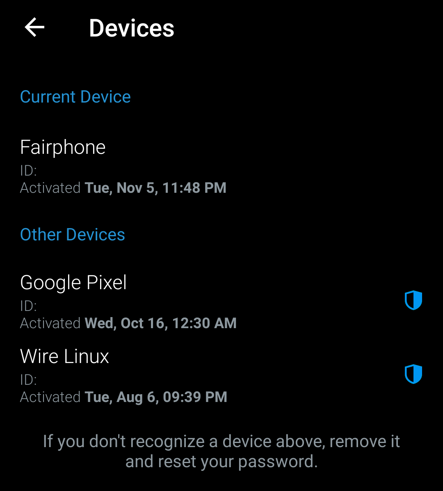

<<<<<<< HEAD
# Check Devices Linked to Chat Applications

Many chat applications allow to link another device to the account in order to read and send messages from a computer. It is possible to use that feature to illegitimately get access to the account and messages exchanged by the application, it is thus interesting to check that there is no unknown session or linked devices.

## Signal

Go to the page "Linked Devices" in Parameters (`...` in the menu) > Settings. You will see a list of connected devices, you can tap on any unknown device in order to disconnect it.

## WhatsApp

Go to Parameters (`...` in the menu) and click on "WhatsApp Web".

You can see here all the web browsers connected to your WhatsApp account.

## Telegram

On your Telegram application, visit the page Settings > Privacy and Security > Active Sessions. This page shows you all the active sessions you have with your account, you can tap on any session to terminate it.

## Wire

On the Wire application, click on your profile and go to `Settings > Devices`. On this page, you can see all the sessions opened for your account, including smartphone applications, desktop applications and web sessions. You can click on any of these sessions and remove the device (you will need your password to do so).

=======
# Verificar dispositivos vinculados a aplicativos de bate-papo

Muitos aplicativos de bate-papo permitem vincular outro dispositivo à conta para ler e enviar mensagens de um computador. É possível usar esse recurso para obter acesso ilegítimo à conta e às mensagens trocadas pelo aplicativo. Portanto, é interessante verificar se não há nenhuma sessão desconhecida ou dispositivos vinculados.

## Signal

Vá para a página “Linked Devices” (Dispositivos vinculados) em Parameters (Parâmetros) (`...` no menu) > Settings (Configurações). Você verá uma lista de dispositivos conectados. Você pode tocar em qualquer dispositivo desconhecido para desconectá-lo.

 

## WhatsApp

Vá para Parameters (`...` no menu) e clique em “WhatsApp Web”.

Você pode ver aqui todos os navegadores da Web conectados à sua conta do WhatsApp.

## Telegram

Em seu aplicativo Telegram, visite a página Configurações > Privacidade e segurança > Sessões ativas. Essa página mostra todas as sessões ativas que você tem na sua conta. Você pode tocar em qualquer sessão para encerrá-la.

## Wire

No aplicativo Wire, clique em seu perfil e vá para `Configurações > Dispositivos`. Nessa página, você pode ver todas as sessões abertas para a sua conta, incluindo aplicativos de smartphone, aplicativos de desktop e sessões da Web. Você pode clicar em qualquer uma dessas sessões e remover o dispositivo (você precisará da sua senha para fazer isso).

>>>>>>> 08764f159532245dbd422df65bec951b7323b37b
