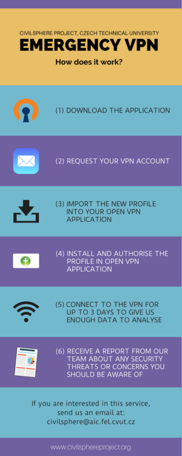

<<<<<<< HEAD
# Monitor Network Traffic

Monitoring network traffic from a phone is one of the best way to identify malicious activity without interacting with the mobile phone hence bypassing any mechanism the malware may have developed to bypass detection. But it requires an external tool to record the traffic and some network knowledge to identify suspicious traffic.

### Limitations

Many mobile apps and malware now enable "SSL Pinning", which makes it hard for us to decrypt their traffic. The only way to bypass SSL Pinning is to root/jailbreak the device and use tools such as Frida. However, for the goal of forensics, we only need to do this if we highly suspect that malicious traffic is hidden with SSL-pinned encryption.

## Monitor DNS Queries

Instead of monitoring full network traffic, which requires a complex setup, we can jiust monitor the DNS queries. Most operating systems allow users to configure their own DNS servers. We can configure our own DNS server to log queries and point the device under test to our server.

We can deploy our own DNS server with:
=======
# Monitorar o tráfego de rede

Monitorar o tráfego de rede de um telefone é uma das melhores maneiras de identificar atividades mal-intencionadas sem interagir com o telefone celular e, portanto, contornar qualquer mecanismo que o malware possa ter desenvolvido para evitar a detecção. Mas isso requer uma ferramenta externa para registrar o tráfego e algum conhecimento de rede para identificar o tráfego suspeito.

Limitações

Muitos aplicativos móveis e malwares agora habilitam o “SSL Pinning”, o que dificulta descriptografar o tráfego. A única maneira de contornar o SSL Pinning é fazer o _root/jailbreak_ do dispositivo e usar ferramentas como Frida. No entanto, para o objetivo da perícia, só precisamos fazer isso se houver forte suspeita de que o tráfego mal-intencionado esteja oculto por meio da criptografia SSL Pinning.

## Monitorar consultas de DNS

Em vez de monitorar todo o tráfego de rede, o que exige uma configuração complexa, podemos monitorar apenas as consultas de DNS. A maioria dos sistemas operacionais permite que os usuários configurem seus próprios servidores DNS. Podemos configurar nosso próprio servidor DNS para registrar as consultas e apontar o dispositivo em teste para ele.

Podemos implantar nosso próprio servidor DNS com:
>>>>>>> 08764f159532245dbd422df65bec951b7323b37b

* Pi-hole
* Adguard Home

<<<<<<< HEAD
Or, use a cloud-based DNS server like NextDNS. The downside of cloud-based DNS servers are that the cloud provider will be able to see the devices' queries.

One cloud DNS provider is NextDNS, which allows you to configure a DNS server without an account. NextDNS also provides apps for major operating systems to configure the device to use your custom server. First, go to [https://my.nextdns.io/start](https://my.nextdns.io/start), which will create a temporary _Configuration ID,_ which you should enter into the NextDNS app. Then, all the DNS queries that the phone is making will be logged in the _Logs_ tab.

## Monitor Full Network Traffic from a Wifi Router

One way to monitor the network traffic from your phone is to record the traffic directly from a WiFi router used by your mobile phone. Depending on your WiFi router, it may be possible to record traffic directly from it (using a tool like [tcpdump](https://www.tcpdump.org/)).

If you cannot record traffic using your actual WiFi router, you can easily build a router using a [Raspberry Pi](https://www.raspberrypi.org/) and the [RaspAP](https://raspap.com/) software (see [here](https://howtoraspberrypi.com/create-a-wi-fi-hotspot-in-less-than-10-minutes-with-pi-raspberry/) for a tutorial on how to install it).

Once your router is installed, you can connect to it using ssh and start capturing the traffic using [tcpdump](https://www.tcpdump.org/). Then connect the mobile phone you want to test to this wifi network and record the traffic for 30 minutes to one hour.

After the end of the capture, download the pcap file on your computer and review the network traffic using [WireShark](https://www.wireshark.org/). Check especially the following elements :

* Connections to IP addresses without DNS requests
* Connections to domains that are not listed in [Alexa Top lists](https://www.alexa.com/siteinfo)
* Connections on ports other than 80 and 443

If you find any suspicious traffic to an IP address or domain, you can use the following tools to get more information on it :

* [CentralOps](https://centralops.net/co/) allows to see the owner of an IP or the whois of a domain (does not require an account)
* [RiskIQ](https://community.riskiq.com/home) allows to see the DNS history and has many indications about malicious IPs and domains (requires an account, limited number of queries with a free account)
* [AlienVault OTX](https://otx.alienvault.com/) is a large database of malicious indicators, you can search for this IP or domain in it to see if there is known malicious activity from it (requires an account, free)

To set up an environment for traffic analysis, refer to [this guide](https://mobile-security.gitbook.io/mobile-security-testing-guide/general-mobile-app-testing-guide/0x04f-testing-network-communication).

## Monitor Network Traffic with On-device Apps

These apps usually works by creating an on-device VPN server and configuring the system to use the VPN server.

* [NetGuard](https://netguard.me/): for Android, open source
* [Lockdown](https://lockdownprivacy.com/firewall): for iOS, open source
* [Blokada](https://apps.apple.com/us/app/blokada/id1508341781): for iOS, proprietary

## How to Look for Suspicious Traffic?

The following behaviors are more suspicious:

* Apps or connections that generate a lot of data traffic.
* Apps or connections that upload more data than download.
* Connections that occur periodically.
* Strange domain names. When encountered, simply search them on Google or VirusTotal.
* Uncommon ports.
* Sending or receiving data when the user is not using the phone. (Such as when they're sleeping.)

## Use Civil Sphere Emergency VPN

The [Civil Sphere Project](https://www.civilsphereproject.org/what-we-do), an organisation born from the [Stratosphere Research Laboratory](https://www.stratosphereips.org/) at the Czech Technical University in Prague, offers an [Emergency VPN](https://www.civilsphereproject.org/emergency-vpn) service to identify compromised devices.

The Emergency VPN service allows to analyze and identify suspicious traffic from a mobile device used by journalists and NGOs. [On demand](https://www.civilsphereproject.org/get-started), the Civil Sphere team will send you credentials to log-in to their VPN with your phone. While using their VPN, they will record all the traffic coming out of your phone for a maximum of three days. At the end of the recording, they will analyze the traffic using automated and manual techniques in order to identify malicious activity or security issues in the applications running on your phone, and send you the result of this analysis by email.

One of the limitation of this technique is that you have to provide network traffic from your mobile phone to a third party organisation (Civil Sphere), you can [contact them](https://www.civilsphereproject.org/get-started) to have more information about how this data is stored and used. The advantage of this solution is that you can rely on them to analyze the network traffic, which can be a complex and time-consuming process.

Check [their website](https://www.civilsphereproject.org/emergency-vpn) for more information.
=======
Ou usar um servidor DNS baseado em nuvem, como o NextDNS. A desvantagem dos servidores DNS baseados em nuvem é que eles poderão ver as consultas dos dispositivos.

Um provedor de DNS em nuvem é o NextDNS, que permite configurar um servidor DNS sem a necessidade de uma conta. Ele também oferece aplicativos para os principais sistemas operacionais, que permitem configurar o dispositivo para usar o servidor personalizado. Primeiro, acesse [https://my.nextdns.io/start](https://my.nextdns.io/start) para criar uma _Configuration ID_ temporária que deve ser inserida no aplicativo NextDNS. Então, todas as consultas de DNS feitas pelo telefone serão registradas na guia _Logs_.

## Monitorar o tráfego de rede completo de um roteador WiFi

Uma maneira de monitorar o tráfego de rede do seu telefone é gravar o tráfego diretamente de um roteador WiFi usado pelo seu telefone celular. Dependendo do seu roteador WiFi, pode ser possível registrar o tráfego diretamente dele (usando uma ferramenta como [tcpdump](https://www.tcpdump.org/)).

Se não for possível registrar o tráfego usando o roteador WiFi real, é possível construir facilmente um roteador usando um [Raspberry Pi](https://www.raspberrypi.org/) e o software [RaspAP](https://raspap.com/) (consulte [aqui](https://howtoraspberrypi.com/create-a-wi-fi-hotspot-in-less-than-10-minutes-with-pi-raspberry/) para acessar um tutorial sobre como instalá-lo).

Depois que o roteador estiver instalado, você poderá se conectar a ele usando SSH e começar a capturar o tráfego usando [tcpdump](https://www.tcpdump.org/). Em seguida, conecte o telefone celular que deseja testar a essa rede WiFi e registre o tráfego durante 30 minutos a uma hora.

Após o término da captura, baixe o arquivo pcap em seu computador e analise o tráfego de rede usando o [WireShark](https://www.wireshark.org/). Verifique especialmente os seguintes elementos:

* Conexões com endereços IP sem solicitações de DNS
* Conexões com domínios que não estão listados nas listas de sites mais acessados
* Conexões em portas diferentes das portas 80 e 443

Se você encontrar algum tráfego suspeito para um endereço IP ou domínio, poderá usar as seguintes ferramentas para obter mais informações sobre ele:

* [CentralOps](https://centralops.net/co/) permite ver o proprietário de um IP ou o _whois_ de um domínio (não requer uma conta)
* [RiskIQ](https://community.riskiq.com/home) permite ver o histórico do DNS e tem muitas indicações sobre IPs e domínios maliciosos (requer uma conta, número limitado de consultas com uma conta gratuita)
* O [AlienVault OTX](https://otx.alienvault.com/) é um grande banco de dados de indicadores de software malicioso, no qual você pode pesquisar esse IP ou domínio para ver se há alguma atividade mal-intencionada conhecida a partir dele (requer uma conta, é gratuito).
* [VirusTotal,](https://www.virustotal.com/) principalmente para os malwares mais comuns.

Para configurar um ambiente para análise de tráfego, consulte [este guia](https://mobile-security.gitbook.io/mobile-security-testing-guide/general-mobile-app-testing-guide/0x04f-testing-network-communication).

## Monitore o tráfego de rede com aplicativos no dispositivo

Esses aplicativos geralmente funcionam criando um servidor VPN no dispositivo e configurando o sistema para usar o servidor VPN.

* [NetGuard](https://netguard.me/): para Android, código aberto
* [Lockdown](https://lockdownprivacy.com/firewall): para iOS, código aberto
* [Blokada](https://apps.apple.com/us/app/blokada/id1508341781): para iOS, proprietário

## Como procurar tráfego suspeito?

Os comportamentos a seguir são mais suspeitos:

* Aplicativos ou conexões que geram muito tráfego de dados.
* Aplicativos ou conexões que enviam mais dados do que baixam.
* Conexões que ocorrem periodicamente.
* Nomes de domínio estranhos. Quando encontrados, basta pesquisá-los no Google ou no VirusTotal.
* Uso de portas incomuns.
* Envio ou recebimento de dados quando o usuário não está usando o telefone. Por exemplo, quando está dormindo.

## Use a VPN de emergência do Civil Sphere

O [Civil Sphere Project](https://www.civilsphereproject.org/what-we-do), uma organização nascida do [Stratosphere Research Laboratory da Universidade Técnica Tcheca](https://www.stratosphereips.org/), em Praga, oferece um [serviço de VPN de emergência](https://www.civilsphereproject.org/emergency-vpn) para identificar dispositivos comprometidos.

O serviço de VPN de emergência permite analisar e identificar o tráfego suspeito de um dispositivo móvel usado por jornalistas e ONGs. Sob demanda, a equipe do Civil Sphere lhe enviará credenciais para fazer login na VPN deles com o seu telefone. Durante o uso da VPN, eles gravarão todo o tráfego que sai do seu telefone por um período máximo de três dias. No final da gravação, eles analisarão o tráfego usando técnicas automatizadas e manuais para identificar atividades mal-intencionadas ou problemas de segurança nos aplicativos em execução no seu telefone e enviarão o resultado dessa análise por e-mail.

<figure><figcaption></figcaption></figure>

Uma das limitações dessa técnica é que você precisa fornecer o tráfego de rede do seu celular a uma organização de terceiros (Civil Sphere). Você pode [entrar em contato com eles](https://www.civilsphereproject.org/get-started) para obter mais informações sobre como esses dados são armazenados e usados. A vantagem dessa solução é que você pode contar com eles para analisar o tráfego de rede, o que pode ser um processo complexo e demorado.

Consulte [o site da organização](https://www.civilsphereproject.org/emergency-vpn) para obter mais informações.
>>>>>>> 08764f159532245dbd422df65bec951b7323b37b
