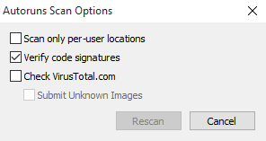
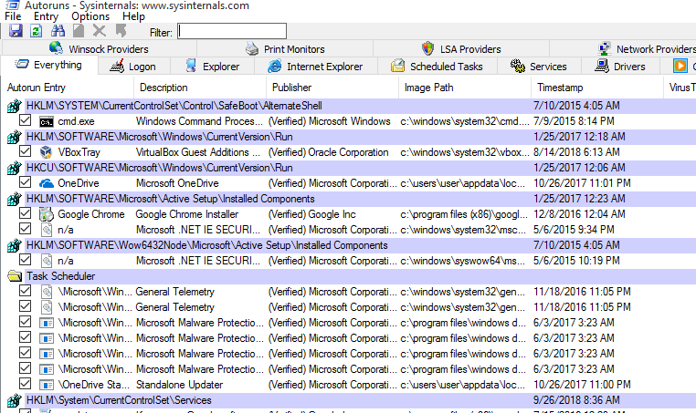
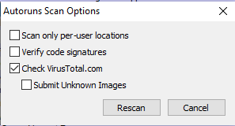
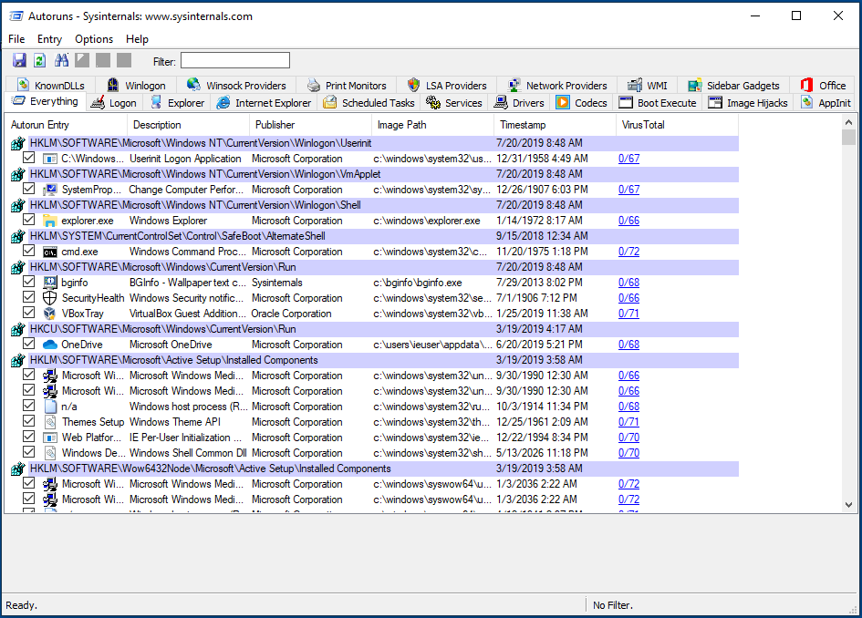

<<<<<<< HEAD
# Review Programs Launching at Startup

Normally, spyware needs to find a way to run on start-up when a computer is restarted. Reviewing applications starting automatically is thus one of the first checks to perform when looking for potential infections. Windows computers have different ways to enable automatic launch, and spyware often use tricks to appear legitimate and/or avoid the most common methods.

[Sysinternals Autoruns](https://technet.microsoft.com/en-ca/sysinternals/bb963902.aspx) is a tool that allows to exhaustively list programs running on start-up. If possible, you should run this program as Administrator:

All results will be displayed by default in the main tab. Clicking through the other available tabs will filter the results by the respective auto-launch type. The most interesting ones generally would be `Logon`, `Scheduled Tasks`, `Services`.

## Looking for suspicious patterns

Autoruns does not automatically determine for you which file are malicious and which not. As with the rest of this methodology, it is necessary for you to eventually become familiar enough with its results to quickly spot any anomalies or entries that you do not recognize. However, Autoruns can provide some useful indications.

Sometimes, Autoruns might flag a particular row with a red background. These might warrant further inspection, as it might be a sign of an unusual entry. Entries marked with a yellow background instead refer to files that do no longer exist on the computer. These entries are therefore broken.

Following are some suggestions on patterns to look out for.

### 1. Verify image signatures

In modern versions of Windows, legitimate applications are generally required to be "signed" with a developer certificate. Such certificates allow to verify the producer of a particular program (such as Microsoft, Google, Adobe, or else). Applications that are not signed normally are more controlled and scrutinized by Windows security mechanisms (such as its embedded antivirus, Windows Defender). A useful first check is to verify whether all applications launching automatically are indeed signed, and this can be done by clicking _Options_ > _Scan Options_ and enabling _Verify code signatures_.

This will relaunch Autoruns' scan and will add a new column called "Publisher". Correctly signed applications will be marked as "(Verified)":

**Beware**: Not all verified Autorun Entries are necessarily safe. Sometimes attackers purposefully abuse legitimate verified applications in order to appear less suspicious, and use them as launchers to then load and execute malicious code. This is sometimes done using, for example, Microsoft `rundll32.exe` or other applications affected by what's known as [DLL Sideloading](https://attack.mitre.org/techniques/T1073/).

### 2. Check the name of the Autorun Entry

Autorun Entry show the name that was given to the application by its developers. This information can be faked, but sometimes attackers are lazy enough to either mispell spoofed legitimate names (e.g. "Micorsoft Ofice" or "Crhome") or to just leave random characters and numbers.

### 3. Check the program description

Similarly, this is not a reliable indicator, but legitimate applications should generally have a program description visible.

### 4. Check the Image Path

Windows provides some standard folders where legitimate applications are normally installed and run from. Services from the operating system itself are normally located under `C:\Windows\`, while user-installed applications are generally located under `C:\Program Files\` or `C:\Program Files (x86)\`. Because installing programs in those folder should require some confirmation from the user, attackers often place their malicious files in less typical folders, such as `C:\Users\<Username>\AppData\` or other subfolders in `C:\Users\`.

Example of suspicious entries:

* The [KeyBoy spyware](https://citizenlab.ca/2016/11/parliament-keyboy/) creates a Registry Key in `HKEY_CURRENT_USER\SOFTWARE\Microsoft\Windows NT\CurrentVersion\Winlogon\shell` with the value `explorer.exe,C:\Windows\system32\rundll32.exe "%LOCALAPPDATA%\cfs.dal" cfsUpdate`
* A particular malware used in Central Asia relies on the use of VBScripts, which are highlighted by Autoruns with a red background, pretending to be Adobe and Google software. These results would definitely warrant further inspection. In addition, the scripts are located under `C:\Users\<Username>\AppData\`:

### Optional: 5. Looking up programs on VirusTotal

Optionally Autoruns allows to check binary files against [VirusTotal](https://www.virustotal.com/gui/home/upload), which helps to immediately identify any malicious program that is well-known and widely detected by Antivirus software (read more about this in the section below). To enable this check, go in _Options_ > _Scan Options_ and enable "_Check VirusTotal.com_". Be careful not to enable "_Submit Unknown Files_", as it would make Autoruns automatically upload the local files to the service, rather than just looking up their cryptographic hashes. VirusTotal is a company, now owned by Alphabet (Google's parent company), and it provides commercial access to its data to security researchers and customers all around the world. Those with access to VirusTotal commercial services are able to look-up and download any uploaded file. Therefore, you might want to avoid inadvertedly submitting any files that might be confidential.

Once the VirusTotal option is enabled, it will take some time for results to appear. Eventually, you should see a VirusTotal column displaying the Antivirus scan results. The results appear as a _X/Y_ value, where _X_ is the number of positive detections and _Y_ is the total amount of Antivirus software the file was scanned with.

If no result is displayed, it means that that particular program has not been previously uploaded to VirusTotal, and it might warrant additional inspection. Sometimes, you wil see some applications with a low detection number (1 or 2): often these are false positives. VirusTotal results showing a higher detection number (for example, 5 and above) is generally a reliable sign that that particular application is malicious. Clicking on the link from the _X/Y_ will open up the browser to the VirusTotal analysis, where you can see more details, such as any malware identifiers used by the Antivirus software supported.

**Please note:** [As discussed](safety.md), under normal circumstances you would prefer to not connect the tested computer to the Internet. Without an Internet connection, you are not able to immediately check with VirusTotal. However, it is possible to save Autoruns results clicking _File_ > _Save..._ and later open the results from a separate computer with Internet connection.
=======
# Revisão de programas abertos na inicialização

Normalmente, o _spyware_ precisa encontrar uma maneira de ser executado quando o computador é reiniciado. Portanto, analisar os aplicativos que são iniciados automaticamente é um dos primeiros passos na busca de possíveis infecções. Os computadores com Windows têm diferentes maneiras de ativar a inicialização automática, e o _spyware_ geralmente usa artifícios para parecer legítimo e/ou evitar os métodos mais comuns.

O [Sysinternals Autoruns](https://technet.microsoft.com/en-ca/sysinternals/bb963902.aspx/) é uma ferramenta que permite listar detalhadamente os programas executados na inicialização. Se possível, você deve executar esse programa como Administrador:

_NB: a interface do Autoruns está disponível em Inglês apenas._

Todos os resultados serão exibidos por padrão na guia principal. Ao clicar nas outras guias disponíveis, os resultados serão filtrados pelo respectivo tipo de inicialização automática. Em geral, os mais interessantes seriam `Logon`, `Tarefas Agendadas (Scheluded`&#x20;

`Tasks)`, `Serviços (Services)`.

## Procurando por padrões suspeitos

O Autoruns não determina automaticamente para você quais arquivos são maliciosos e quais não são. Como no restante desta metodologia, é necessário que você se familiarize o suficiente com os resultados para identificar rapidamente quaisquer anomalias ou entradas que não reconheça. Entretanto, o Autoruns pode fornecer algumas indicações úteis.

Às vezes, o Autoruns pode marcar uma determinada linha com um fundo vermelho. Isso pode justificar uma inspeção mais detalhada, pois pode ser um sinal de uma entrada incomum. No entanto, as entradas marcadas com um fundo amarelo referem-se a arquivos que não existem mais no computador. Portanto, essas entradas estão quebradas.

Veja, a seguir, algumas sugestões de padrões a serem observados.

### 1. Verificar assinaturas de imagem

Nas versões modernas do Windows, os aplicativos legítimos geralmente precisam ser “assinados” com um certificado de desenvolvedor. Esses certificados permitem verificar o produtor de um determinado programa (como Microsoft, Google, Adobe ou outro). Os aplicativos que não são assinados normalmente são mais controlados e examinados pelos mecanismos de segurança do Windows (como o antivírus incorporado, o Windows Defender). Uma primeira verificação útil é verificar se todos os aplicativos iniciados automaticamente estão de fato assinados, e isso pode ser feito clicando em _Opções_ > _Opções de verificação_ e ativando _Verificar assinaturas de código_.

Isso reiniciará a verificação do Autoruns e adicionará uma nova coluna chamada “Publisher”. Os aplicativos assinados corretamente serão marcados como “(Verificado)”:

**Cuidado**: Nem todas as entradas de execução automática verificadas são necessariamente seguras. Às vezes, os invasores abusam propositalmente de aplicativos verificados legítimos para parecerem menos suspeitos e os usam como iniciadores para carregar e executar códigos mal-intencionados. Isso, às vezes, é feito usando, por exemplo, o Microsoft `rundll32.exe` ou outros aplicativos afetados pelo que é conhecido como [DLL Sideloading](https://attack.mitre.org/techniques/T1574/002/).

### 2. Verifique o nome da entrada de execução automática

A entrada de execução automática mostra o nome que foi dado ao aplicativo pelos seus desenvolvedores. Essas informações podem ser impostoras, mas, às vezes, os invasores são preguiçosos o suficiente para escrever incorretamente os nomes legítimos falsificados (por exemplo, “Micorsoft Ofice” ou “Crhome”) ou simplesmente deixar caracteres e números aleatórios.

### 3. Verifique a descrição do programa

Da mesma forma, esse não é um indicador confiável, mas os aplicativos legítimos geralmente devem ter uma descrição do programa visível.

### 4. Verifique o caminho da imagem

O Windows fornece algumas pastas padrão nas quais os aplicativos legítimos são normalmente instalados e executados. Os serviços do próprio sistema operacional normalmente estão localizados em `C:\Windows\`, enquanto os aplicativos instalados pela usuária geralmente estão localizados em `C:\Program Files\` ou `C:\Program Files (x86)\`. Como a instalação de programas nessas pastas deve exigir alguma confirmação da usuária, os atacantes geralmente colocam seus arquivos maliciosos em pastas menos comuns, como `C:\Users\<Username>\AppData\` ou outras subpastas em `C:\Users\`.

Exemplo de entradas suspeitas:

* O spyware [KeyBoy](https://citizenlab.ca/2016/11/parliament-keyboy/) cria uma chave de registro em `HKEY_CURRENT_USER\SOFTWARE\Microsoft\Windows NT\CurrentVersion\Winlogon\shell` com o valor `explorer.exe,C:\Windows\system32\rundll32.exe “%LOCALAPPDATA%\cfs.dal” cfsUpdate`
* Um malware específico usado na Ásia Central se baseia no uso de VBScripts, que são destacados pelo Autoruns com um fundo vermelho, fingindo ser software da Adobe e do Google. Esses resultados definitivamente justificariam uma inspeção mais detalhada. Além disso, os scripts estão localizados em `C:\Users\<Username>\AppData\`:

### 5. Procurando programas no VirusTotal (Opcional)

Opcionalmente, o Autoruns permite verificar arquivos binários no [VirusTotal](https://www.virustotal.com/gui/home/upload/), o que ajuda a identificar imediatamente qualquer programa malicioso que seja bem conhecido e amplamente detectado pelo software antivírus (leia mais sobre isso na seção abaixo). Para ativar essa verificação, vá para _Options_ > _Scan Options_ e ative “_Check VirusTotal.com_”. Tenha cuidado para não ativar “_Submit Unknown Files_”, pois isso faria com que o Autoruns enviasse automaticamente os arquivos locais para o serviço, em vez de apenas procurar seus _hashes_ criptográficos. VirusTotal é uma empresa que fornece acesso comercial dos seus dados para pesquisadoras de segurança e clientes em todo o mundo. Agora, ela pertence à Alphabet (empresa controladora do Google). As usuárias dos serviços comerciais da VirusTotal podem pesquisar e baixar qualquer arquivo carregado. Portanto, convém evitar o envio inadvertido de arquivos confidenciais.

<figure><figcaption></figcaption></figure>

Quando a opção VirusTotal estiver ativada, levará algum tempo para que os resultados apareçam. Eventualmente, você verá uma coluna, nomeada como VirusTotal, exibindo os resultados da verificação do Antivírus. Os resultados aparecem como um valor _X/Y_, em que _X_ é o número de detecções positivas e _Y_ é a quantidade total de software antivírus com o qual o arquivo foi verificado.&#x20;

<figure><figcaption></figcaption></figure>

Se nenhum resultado for exibido, isso significa que esse programa específico não foi carregado anteriormente no VirusTotal e pode justificar uma inspeção adicional. Às vezes, você verá alguns aplicativos com um número de detecção baixo (1 ou 2): geralmente esses são falsos positivos. Os resultados do VirusTotal que mostram um número de detecção mais alto (por exemplo, 5 ou mais) geralmente são um sinal confiável de que esse aplicativo específico é mal-intencionado. Clique no link do X/Y para abrir o navegador e começar uma análise do VirusTotal, onde você poderá ver mais detalhes, como quaisquer identificadores de malware usados pelo programas antivírus da lista do VirusTotal.

**Observação:** conforme [discutido em Segurança](../safety.md), em circunstâncias normais, é preferível não conectar o computador sendo testado à Internet. Mas sem uma conexão com a Internet, não é possível fazer uma verificação imediata com o VirusTotal. No entanto, é possível salvar os resultados do Autoruns clicando em Arquivo > Salvar... e, posteriormente, abrir os resultados em um computador separado com conexão à Internet.
>>>>>>> 08764f159532245dbd422df65bec951b7323b37b
